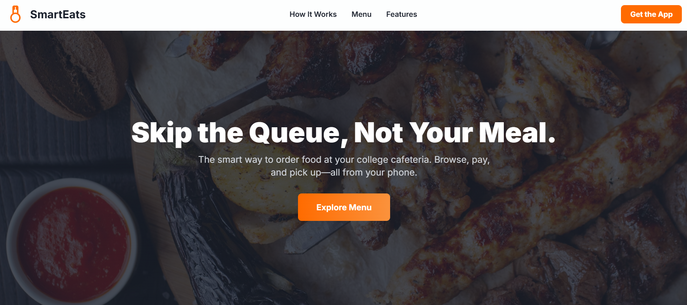
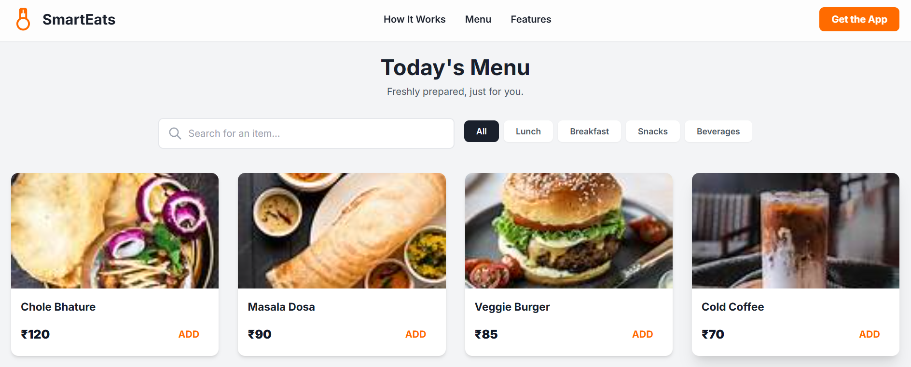
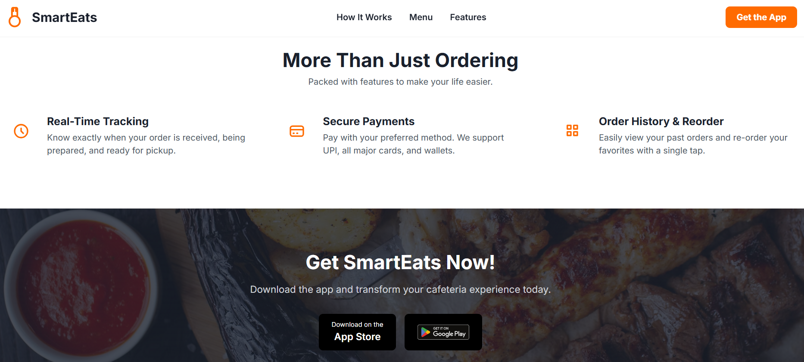

**SmartEats**
 **Description**

SmartEats is a smart cafeteria food ordering system designed to simplify and digitalize the food ordering process in cafeterias. It allows users to explore menus, place orders, and track them in real-time — reducing queues, saving time, and ensuring a smoother dining experience.

💡 **Importance**

SmartEats enhances cafeteria management by bringing efficiency and convenience to both customers and staff.
It minimizes manual work, reduces order errors, and encourages a faster service cycle.
With SmartEats, the entire food ordering experience becomes faster, smarter, and more organized.

✨**Features**

📋 Digital Menu: View all available items with prices and descriptions.

🛒 Easy Ordering: Place orders quickly from your device.

⏱️ Real-Time Tracking: Check the live status of your order.

💳 Secure Payment: Supports digital and cashless transactions.

🔔 Instant Notifications: Get updates when your order is ready.

👩‍🍳 Admin Panel: Manage menu, orders, and inventory efficiently.
